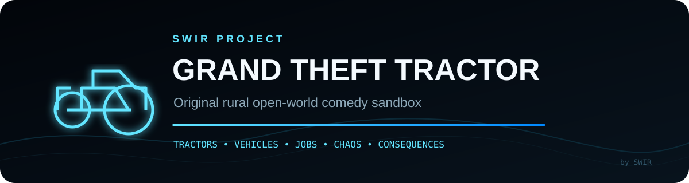
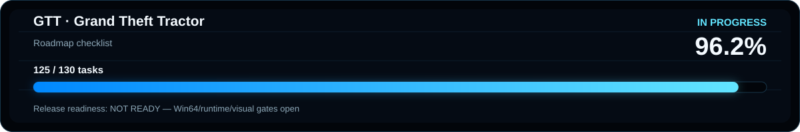

<!-- SWIR-README-STANDARD:v2 -->

<div align="center">



<br>


[](https://github.com/Swir/GTT/actions/workflows/project-sanity.yml)


[**Status**](#project-status) · [**Highlights**](#highlights) · [**Quick Start**](#quick-start--from-source) · [**Roadmap**](#roadmap) · [**Releases**](#releases--downloads)

</div>


## Project status

GTT is in **pre-alpha active development**. The repository contains a large playable-systems foundation, source-level CI and Windows packaging/evidence automation, but the first public demo is intentionally gated behind real Unreal Engine 5.8 Win64 packaging, packaged-EXE runtime smoke tests and rendered visual acceptance.

**No public demo release is available yet.** Source CI passing does not mean a Windows demo EXE has been verified.



Roadmap checklist: **125 / 130 tasks complete (96.2%)**. Release readiness: **NOT READY** — the remaining gates require real Win64/runtime/visual evidence and are not inferred from source CI.

Current development milestone: **0.1.52 — packaged workshop priority & pickup evidence**.

## What is GTT?

Grand Theft Tractor is an original countryside sandbox about causing trouble, taking legal work, maintaining a rough vehicle fleet and dealing with consequences in a living rural world. The project combines tractors, an old car, a farm van, traffic, NPC schedules, farming/logistics work, fishing and poaching, police pursuit, game-warden enforcement, combat, day/night systems, economy, save/load and a growing story campaign.

The tone is comedic and chaotic, but the gameplay systems are designed to connect: vehicle condition changes jobs, terrain affects grip, illegal activity feeds law response, cargo and dispatch systems affect earnings, and police/warden systems share the same authoritative wanted/economy state instead of acting as isolated demos.

## Highlights

| Feature | What it does |
|---|---|
| 🚜 Multi-vehicle sandbox | Tractor, old car and farm van roles with garage ownership, recall, fuel, condition and tuning; same-model legacy instances use collision-safe persistent IDs before ownership. |
| 🛞 Chaos vehicle migration | Native Chaos drivetrain/wheel/suspension work is integrated behind explicit runtime acceptance gates. |
| 💥 Vehicle damage | Tire wear, breakable panels, overheating, mechanical faults, collision damage and recovery/service loops. Eligible native road vehicles can authorize a paid temporary patch or tow with a request-time locked quote, exact target identity and same-key cancellation before arrival; a damage-preserving tow can place a TOW/IMMOBILE vehicle on workshop hold so garage recall cannot bypass required service. Regular workshop repair/refuel runs 06:30–20:00, while a hard hold keeps an after-hours emergency recovery path at a +35% surcharge. Ordinary damaged/mobile native road vehicles can hold one of four persistent exact-ID appointments with locked quotes, timed 30–90 minute service, no pre-charge, STANDARD/URGENT priority, a physical job board for lifecycle status/guarded cancellation, and explicit paid pickup before fleet redispatch. |
| 🚓 Police escalation | Wanted heat, pursuit vehicles, roadblocks, spike strips, interception and arrest consequences. |
| 🌲 Game-warden enforcement | Wildlife alerts, ranger pursuit, night reinforcement, police handoff, citations, seizure, lane-aware road stops, physical shoulder pull-over guidance, compact COMPLY/SEARCH/FLEE HUD, patrol-scene lighting and nearby civilian reactions. |
| 🌾 Legal rural work | Farm cargo, mowing, timber hauling, recovery and heavier trailer/logistics jobs tied to economy and vehicle condition. Farm Cargo locks the actual loaded vehicle to the contract so another vehicle cannot complete its handoff. |
| 📦 Living logistics | ROAD/CARGO dispatch, depot stock, urgency, reservations, relationship favors, backlog and route-planning consequences. |
| 🧑‍🌾 Living village | Civilian NPCs, schedules, traffic, day/night cycle, social venues and countryside activity. |
| 🔫 Combat & factions | Rural arsenal, hostile archetypes, repeatable faction encounters and persistent campaign consequences. |
| 💾 Persistent sandbox | Save/load for core progression, fleet state, tuning, economy, campaign systems and active Farm Cargo route/vehicle identity recovery, including exact-ID actor rebinding, in-flight roadside dispatch checkpoints and additive multi-vehicle workshop reservations. |
| 📻 Original radio framework | Four fictional stations with track rotation and project-owned/cleared audio workflow. |
| 🎮 Input support | Keyboard/mouse plus controller mappings for movement, vehicles, interaction, combat, radio, roadside recovery and save/load. |

## Quick start — from source

There is no verified public demo build yet, so the current reliable path is the Unreal project source.

1. Clone the repository.
2. Install **Unreal Engine 5.8**.
3. Install Visual Studio 2022 with **Game development with C++** and a compatible Windows SDK.
4. Generate project files from `GTT.uproject` if your Unreal installation requires it.
5. Build the `GTTEditor` target.
6. Open `GTT.uproject` in Unreal Editor.

```bash
git clone https://github.com/Swir/GTT.git
cd GTT
```

The repository intentionally excludes generated Unreal folders and Unreal Engine source code.

## Requirements / compatibility

| Requirement | Current project target |
|---|---|
| Engine | Unreal Engine 5.8 |
| Desktop target | Windows / Win64 |
| Compiler toolchain | Visual Studio 2022 C++ toolchain |
| Unreal plugins | Enhanced Input, Chaos Vehicles |
| Source control | Git; Git LFS is expected for large binary assets when needed |

A full Win64 Unreal compile/package/runtime pass still requires a qualifying Windows runner with Unreal Engine 5.8. Linux source-contract CI is useful for regressions but is **not** treated as packaged-game verification.

## Controls

Current default mappings plus world-level recovery controls:

| Action | Keyboard / mouse | Controller |
|---|---|---|
| Move | `WASD` | Left stick |
| Look | Mouse | Right stick |
| Jump | `Space` | Bottom face button |
| Interact | `E` | Left face button |
| Vehicle throttle / reverse | `W` / `S` | Right / left trigger axis |
| Vehicle steering | `A` / `D` | Left stick |
| Exit vehicle | `F` | Right face button |
| Attack | Left mouse button | Right trigger |
| Next weapon | `Q` | Right shoulder |
| Drop weapon | `G` | D-pad down |
| Radio next | `R` | D-pad right |
| Emergency roadside patch / cancel pending patch | `Y` | D-pad left |
| Roadside tow / cancel pending tow | `T` | D-pad up |
| Quick save | `F5` | Special left |
| Quick load | `F9` | Special right |

## Gameplay architecture

GTT uses a C++ gameplay core with Blueprint-friendly APIs. Major systems are separated into focused modules/folders under `Source/GTT`, including vehicles, police, wanted state, ranger enforcement, NPCs, traffic, missions, economy, save systems, combat, UI and world simulation.

Vehicle development currently uses a guarded migration model: proven gameplay state remains available while native Chaos components gain dedicated runtime evidence and acceptance checks. This prevents a source-only configuration change from being mistaken for verified packaged physics behavior.

Farm Cargo uses the same pattern for physical delivery authority: the job director owns contract/economy state, while `UGTTFarmCargoAuthoritySubsystem` binds the exact loaded vehicle and verifies that same physical vehicle is present and stopped at each buyer handoff. Since 0.1.30, the active route and stable persistent vehicle ID are saved in the existing primary snapshot; after load or actor recreation, authority may rebind only an actor carrying that exact ID. Presentation markers do not own payout, reputation, Wanted or save state.

Milestone 0.1.29 added an opt-in packaged-runtime exercise that drives the existing Farm Cargo path through real terminals and authorities: contract acceptance, exact-vehicle pickup binding, deliberate wrong-vehicle rejection, Hill Farm relay, North Wood Yard completion, payout/reputation observation and save verification. Milestone 0.1.30 hardened the ordinary player save path around that same loop: ReachPickup, loaded delivery and Hill Farm relay checkpoints persist without re-reserving stock, the exact cargo vehicle can recover after save/load or garage actor recreation, and a legacy writer can no longer downgrade the primary snapshot to schema v3.

Milestone 0.1.31 hardened the identity foundation used by that recovery path. `UGTTVehicleIdentitySubsystem` prevents later unowned same-model legacy vehicles from silently reusing an already-observed persistent ID, while refusing to rename IDs that are already owned/persisted. Its packaged evidence route saves a loaded contract, destroys/recreates the exact cargo Mulebox actor, reloads the real primary save, rejects a different same-model van after reload, repeats save/load at the Hill Farm relay, completes North Wood Yard and reloads the completed snapshot to prove the contract does not resurrect or pay twice.

Milestone 0.1.32 connected active Farm Cargo to native breakdown, roadside tow and police impound consequences without creating a second contract authority. The exact loaded `PersistentVehicleId` remains authoritative through recovery, the delivery clock keeps running, pre/post recovery checkpoints use the primary save, and another vehicle cannot inherit the load.

Milestone 0.1.33 adds a later packaged evidence window that must exercise that production path with the native Mulebox: real pickup, disabled tires, player-authorized paid tow, primary-save checkpointing, exact-ID continuity, non-paused cargo timer, no repair of ordinary tow damage, post-tow wrong-vehicle rejection, Hill Farm/North Wood Yard completion, payout/reputation and save. The harness is inert during normal play and restores its temporary evidence baseline after the proof.

Milestone 0.1.34 turns roadside recovery into a clearer gameplay choice. Eligible native road vehicles can pay for a temporary limp-home patch or choose a tow; severe body/structural failures remain tow-only, wanted heat blocks ordinary player service, and automatic police impound remains limited to genuinely stranded vehicles. Farm Cargo checkpoints before/after a patch, verifies the same persistent cargo vehicle ID and never pauses the delivery clock or transfers the load to a substitute vehicle.

Milestone 0.1.35 strengthens the packaged Farm Cargo evidence route so it must exercise that emergency patch inside the authoritative contract. The same native Mulebox is damaged into a patch-eligible `TowRecommended` state, pays the production patch quote, keeps its exact cargo identity and body damage, continues the route clock through service and the real recovery cooldown, then is deliberately broken down again for the existing paid tow path. A decoy vehicle must still be rejected before the exact Mulebox finishes Hill Farm and North Wood Yard through the real terminals. This remains an evidence contract until an actual packaged Win64 candidate emits the required PASS manifest.

Milestone 0.1.36 makes voluntary roadside help a request-time contract instead of a mutable delayed action. Patch and tow pin the exact `PersistentVehicleId` and accepted quote when authorized, reject a changed target before charge or vehicle mutation, expose the pending service/quote/countdown/target to Blueprint-friendly UI, allow same-key cancellation before arrival with no charge, and require explicit cancellation before switching service type. Wanted heat can invalidate voluntary dispatch, while automatic police impound remains a separate non-cancellable consequence for genuinely stranded vehicles.

Milestone 0.1.37 wires that authoritative dispatch contract into the native vehicle and Farm Cargo HUD. Once a service is accepted, presentation reads the locked quote, live ETA and pinned target ID from `UGTTRoadsideRecoverySubsystem` instead of recalculating mutable estimates; active cargo also reports whether the dispatch target still matches the exact loaded vehicle.

Milestone 0.1.38 adds a later packaged evidence route for those same production contracts. It accepts real Farm Cargo, binds the exact native Mulebox, observes a locked patch quote and decreasing ETA, cancels with no charge, repeats the same proof for tow, re-requests patch and verifies the final charge equals the locked quote, then rejects a decoy vehicle before completing Hill Farm and North Wood Yard through normal terminals. The generated runtime manifest is required by the Win64 evidence workflow but is not claimed until the packaged executable actually emits PASS evidence.

Milestone 0.1.39 persists an in-flight voluntary PATCH/TOW as a small transactional SaveGame sidecar. It stores only the exact target `PersistentVehicleId`, locked quote, remaining ETA and conservative authorization-time replay guards; cash is still charged only by the production completion path. Restore waits for the exact vehicle + driver, rejects Wanted/conflicting/invalid state and preserves active Farm Cargo vehicle authority instead of transferring service to a substitute.

Milestone 0.1.40 adds the packaged evidence contract for that persistence path. The deterministic route saves and reloads the primary world around real sidecar checkpoints, proves restored tow quote/ETA/exact-ID plus no-charge cancellation, proves Wanted invalidation fails closed without charge, restores a patch and proves one exact locked-quote debit, then finishes the same Farm Cargo contract through wrong-vehicle rejection, Hill Farm and North Wood Yard. The technical demo gate advances to schema 12, but this remains a future runtime requirement until the exact candidate executes on a qualifying UE 5.8 Win64 runner.

Milestone 0.1.41 closes the garage-recall loophole after an ordinary roadside tow. The tow still preserves damage and exact identity at the workshop, while the numbered garage bays now treat authoritative `TOW`/`IMMOBILE` fleet states as a hard WORKSHOP HOLD before any recall movement or fee. The existing paid native workshop service clears the underlying damage state, saves progress and naturally releases the hold; `LIMP` and ordinary `SERVICE` states remain advisory so drivable marginal vehicles are not unnecessarily locked out.

Milestone 0.1.42 adds a future packaged evidence route for that same recovery loop. The exact Farm Cargo Mulebox must survive ordinary tow, hard WORKSHOP HOLD, a rejected garage-recall bypass and the existing paid native workshop service before continuing through wrong-vehicle rejection and final delivery. `FARM_CARGO_WORKSHOP_RECOVERY_RUNTIME.json` is required before the future demo technical gate can be promoted to schema 13; source CI does not claim that packaged proof has run.

Milestone 0.1.43 makes workshop availability part of the living village clock instead of an always-open service menu. Regular repair/refuel is available from 06:30 through 20:00; after closing, ordinary mobile vehicles wait for opening while a real `TOW`/`IMMOBILE` WORKSHOP HOLD keeps an emergency recovery path at a deterministic +35% surcharge. The surcharge uses the same authoritative repair quote, service mutation, rollback and save path, and the garage office exposes the current OPEN/CLOSED schedule so the rule is visible before dispatch decisions.

Milestone 0.1.44 extends that policy into the future packaged candidate. A later deterministic runtime window proves the actual 06:30–20:00 boundaries, rejects ordinary closed-hours service before cash or vehicle mutation, creates a hard hold through the production roadside tow, verifies the exact +35% emergency checkout quote and single debit, then requires real repair/refuel, hold release and stable persistent vehicle identity. `WORKSHOP_HOURS_RUNTIME.json` is required before the existing schema-13 technical gate can be promoted to schema 14; source CI does not claim that packaged proof has run.

Milestone 0.1.45 turns closed-hours ordinary repair into a persistent deferred service rather than a dead end. From the garage desk, one nearby owned damaged/mobile native road vehicle can reserve the next workshop opening with its exact `PersistentVehicleId`, request-time locked repair quote and no pre-charge. `GTT_WorkshopQueue_01` preserves that reservation through reload; at/after opening, only the same owned exact-ID vehicle parked by a real workshop terminal can execute the existing authoritative repair, economy and primary-save path. Insufficient cash leaves the reservation unpaid, mutation failure refunds the exact debit, active Farm Cargo requires the same bound vehicle, and hard TOW/IMMOBILE WORKSHOP HOLD remains on the separate +35% emergency lane.

Milestone 0.1.46 extends the persistent workshop queue into the future packaged candidate. A later deterministic runtime window books after hours with no pre-charge, reloads the real queue sidecar from disk, proves a different owned vehicle cannot consume the reservation at opening, then services only the exact queued vehicle with one locked-quote debit, sidecar cleanup, stable identity and preserved Farm Cargo authority. `WORKSHOP_QUEUE_RUNTIME.json` is required before the schema-14 technical gate can promote to schema 15; source CI does not claim this packaged proof has run.

Milestone 0.1.47 expands deferred workshop service into a bounded multi-vehicle appointment system. Up to four owned damaged/mobile native road vehicles can hold independent exact-ID, request-time locked-quote reservations with deterministic 45-minute slots and additive SaveGame persistence. Booking and exact-ID cancellation take no cash; an underfunded due appointment stays queued without blocking later affordable vehicles, while successful service charges only that appointment's locked quote exactly once. Hard TOW/IMMOBILE WORKSHOP HOLD remains on the separate emergency lane, and the existing 0.1.46 packaged single-appointment evidence contract remains backward compatible.

Milestone 0.1.48 adds packaged-capacity evidence for two independent exact-ID appointments on the same candidate. The future runtime route proves persistence, deterministic 45-minute spacing, cancellation/rebooking, an underfunded due vehicle that does not block the later affordable appointment, exact locked-quote debit and Farm Cargo continuity. The demo technical gate target advances only with real same-SHA packaged PASS evidence; source CI remains non-runtime proof.

Milestone 0.1.49 makes deferred appointments physical timed work instead of instant due-time mutation. The exact booked vehicle must reach the workshop and progress through `READY → IN_SERVICE → AWAITING_PAYMENT → checkout`; service takes 30–90 in-world minutes based on vehicle workload, leaving the service area pauses safely, and the ordinary workshop terminal cannot bypass the queue's locked quote or persisted timer. Hard WORKSHOP HOLD remains the higher-priority emergency lane.

Milestone 0.1.50 adds a physical workshop job board beside the garage. It reads the authoritative four-slot queue and presents exact vehicle identity, locked quote, lifecycle state and ETA without becoming a second repair/economy authority. Waiting/ready appointments gain an exact-ID two-step cancellation guard; checked-in/payment states remain queue-owned. The milestone adds a 48-case source/playtest matrix and leaves all five Native Chaos, trailer and Win64 runtime/visual blockers unchanged.

Milestone 0.1.51 adds deliberate workshop priority and an explicit fleet-return handoff without creating a second economy authority. A separate exact-ID priority desk can promote a waiting STANDARD appointment to URGENT with a persisted +20% locked checkout quote and x0.80 service duration, always without pre-charge. After the existing timed service completes and the locked quote is paid once, the exact repaired vehicle remains `READY_FOR_PICKUP`; the job board releases it only when that exact vehicle is physically at the workshop, and numbered garage dispatch stays on PICKUP HOLD until collection. Legacy workshop evidence uses an evidence-only bridge that calls the same production pickup API rather than bypassing repair/payment logic.

Milestone 0.1.52 extends that production loop into the future exact packaged candidate. A later deterministic window must book STANDARD after hours, promote the same `PersistentVehicleId` to URGENT, prove the exact +20% persisted locked quote with no pre-charge, prove x0.80 timed service, one locked-quote debit, persisted `READY_FOR_PICKUP`, wrong-ID pickup rejection, exact-ID fleet release with no second charge and unchanged Farm Cargo authority. `WORKSHOP_PRIORITY_PICKUP_RUNTIME.json` can promote an already-PASS schema-16 capacity gate to schema 17 only for the same candidate SHA. Source CI verifies the contract wiring but does not claim the UE 5.8 Win64 executable has produced this evidence.

## Verification

The repository contains a large set of Python source-contract sanity checks under `Scripts/`, plus dedicated GitHub Actions workflows for major milestones. Release-oriented automation also records Win64 preflight/build/runtime evidence when a qualifying Unreal Windows runner is available.

A successful future packaged Farm Cargo candidate must produce `FARM_CARGO_RUNTIME.json` (`gtt.farm-cargo-runtime.v1`), `FARM_CARGO_RECOVERY_RUNTIME.json` (`gtt.farm-cargo-recovery-runtime.v1`), `FARM_CARGO_BREAKDOWN_RUNTIME.json` (`gtt.farm-cargo-breakdown-runtime.v2`), `FARM_CARGO_DISPATCH_RUNTIME.json` (`gtt.farm-cargo-dispatch-runtime.v1`), `FARM_CARGO_DISPATCH_PERSISTENCE_RUNTIME.json` (`gtt.farm-cargo-dispatch-persistence-runtime.v1`), `FARM_CARGO_WORKSHOP_RECOVERY_RUNTIME.json` (`gtt.farm-cargo-workshop-recovery-runtime.v1`), `WORKSHOP_HOURS_RUNTIME.json` (`gtt.workshop-hours-runtime.v1`), `WORKSHOP_QUEUE_RUNTIME.json` (`gtt.workshop-queue-runtime.v1`), `WORKSHOP_CAPACITY_RUNTIME.json` (`gtt.workshop-capacity-runtime.v1`) and `WORKSHOP_PRIORITY_PICKUP_RUNTIME.json` (`gtt.workshop-priority-pickup-runtime.v1`). These progressively prove exact-vehicle contract continuity, mid-route save/load + recreated-actor rebinding, emergency patch + exact-ID/body/timer continuity followed by deliberate re-breakdown/paid tow, locked-quote/live-ETA/cancellation/re-request dispatch authority, dispatch-sidecar SaveGame restore/replay safety, tow → hard hold → blocked recall → paid workshop recovery continuity, clock-boundary/closed-service rejection plus exact after-hours emergency quote/service behavior, persisted deferred workshop booking with exact-ID/locked-quote disk checkpointing and substitute rejection, independent multi-vehicle capacity/non-blocking checkout, and finally STANDARD→URGENT +20%/x0.80 timing with one debit and explicit exact-ID paid pickup. **None of these manifests is claimed until the packaged Unreal executable actually runs and emits the required PASS evidence.**

The roadmap graphics are deterministic outputs of `Scripts/generate_progress_svg.py`; `--check` verifies checklist mathematics, XML, bounded fill geometry, README/Roadmap embeds, SVG-only presentation and separation between roadmap completion and release readiness.

Important distinction:

- **Source-contract CI:** verifies repository structure, wiring, invariants and regression contracts.
- **Unreal runtime acceptance:** must come from an actual UE 5.8 Win64 build/package run.
- **Demo acceptance:** additionally requires packaged-EXE smoke testing and visual approval of the exact candidate.

## Roadmap

The authoritative roadmap is [`Docs/ROADMAP.md`](Docs/ROADMAP.md).

Current truth: **125 / 130 tasks complete (96.2%)**. The remaining items are deliberately limited to real Native Chaos, authored-trailer and Win64 runtime/build acceptance blockers; they are not closed by source CI alone.

## Releases / downloads

**No public demo release is available yet.**

When the demo gate is genuinely satisfied, verified Windows artifacts and release notes will appear under [GitHub Releases](https://github.com/Swir/GTT/releases). Until then, the repository should be treated as active source development rather than a finished downloadable game.

## Repository structure

```text
GTT/
├── .github/workflows/       # source CI + Win64 evidence/release workflows
├── assets/readme/           # project hero + deterministic progress SVG assets
├── Config/                  # Unreal project/input configuration
├── Content/                 # Unreal project assets
├── Docs/                    # roadmap, playtests and design/acceptance notes
├── Scripts/                 # milestone, progress and release sanity verifiers
├── Source/GTT/              # runtime C++ gameplay module
├── CHANGELOG.d/             # milestone changelog fragments
├── GTT.uproject
└── README.md
```

## Originality, assets and limitations

GTT is an original project. It does not use protected maps, models, logos, music, code or other proprietary assets from unrelated commercial games. Third-party assets may only be included when their license permits redistribution and their notices are preserved.

The current repository also contains prototype/source-built presentation and systems that still require final authored art, real packaged-runtime testing and visual acceptance before a public demo is appropriate.

## 🔎 Search Keywords

`original sandbox game` • `tractor game` • `rural open world game` • `Unreal Engine tractor game` • `Unreal Engine 5.8 game` • `Windows vehicle sandbox` • `Chaos Vehicles game` • `farming action sandbox` • `countryside driving game` • `police chase sandbox` • `game warden gameplay` • `vehicle damage simulation` • `rural logistics game` • `Farm Cargo save load` • `vehicle breakdown recovery` • `roadside emergency repair` • `multi-vehicle workshop appointments` • `workshop job board` • `timed vehicle service` • `C++ Unreal game`


<div align="center">

### `DRIVE • WORK • BREAK RULES • SURVIVE`

⭐ **If this project interests you, consider leaving a star.**

[**← SWIR profile**](https://github.com/Swir) · [**All projects →**](https://github.com/Swir?tab=repositories)

</div>
